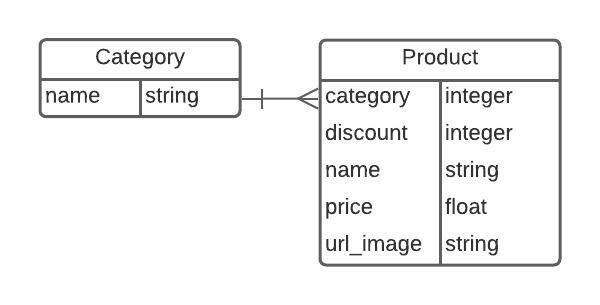

# Bsale Challenge - Backend

## Challenge Overview

The challenge requires the implementation of a server and a client side app for an online store. The frontend and the backend apps communicate through a REST API. An existing MySQL database is provided wich comprises products and categories. Additionally, 

## Server side application

The server side application is a RESTful JSON API  and it was implemented using Ruby on Rails.

### Models
The app has two models Product and Category.
Product and Category models were created by linking the corresponding database tables and follow this ERD diagram:


<br />




<br />

### Controllers and Routes

| Verb 	| URI pattern       	| Controller#Action 	|
|------	|-------------------	|-------------------	|
| GET  	| "/"               	| application#root  	|
| GET  	| "/products"       	| products#index    	|
| GET  	| "/products/:id"   	| products#show     	|
| GET  	| "/categories"     	| categories#index  	|
| GET  	| "/categories/:id" 	| categories#show   	|

### Concerns

1. Exception Handler:\
A module that rescues ActiveRecord::RecordNotFound and ActiveRecord::RecordInvalid where it is included by using the included
method from ActiveSupport::Concern. It sends a json response with the error message and the response code.

```shell
  module ExceptionHandler
    extend ActiveSupport::Concern

    included do
      rescue_from ActiveRecord::RecordNotFound do |e|
        json_response({ message: e.message }, :not_found)
      end

      rescue_from ActiveRecord::RecordInvalid do |e|
        json_response({ message: e.message }, :unprocessable_entity)
      end
    end
  end
```

2. Response:\
A module that provides the method json_response that takes an object and a status code for arguments and renders the object as json with the status code provided.
```shell
  module Response
    def json_response(object, status = :ok)
      render json: object, status: status
    end
  end
```
### Search
Products search is executed by the `search_results` private method inside the products controller. It parses the user query, takes every word and retrieves the products with a matching name or category.

```shell
  def search_results
    queries = params[:q].split(" ")
    partials = queries.map do |q|
      Product.where("product.name LIKE :q", q: "%#{q}%").or(
        Product.where(category: Category.where("category.name LIKE :q", q: "%#{q}%"))
      )
    end
    partials.reduce(:or).page(params[:page]).per(params[:per_page])
  end
```

### Pagination
The gem ``kaminari` was used for pagination.
Usage: https://github.com/kaminari/kaminari


### Countermeasures against SQL injections
Rails security guide (https://guides.rubyonrails.org/security.html#sql-injection) was followed in order to prevent SQL injections.
Parameters were never passed directly as SQL queries. User input was passed as named parameters or ActiveRecord methods that escape or sanitize user input like Model.find(:id) were used which is what the guide recommends.


## API Documentation

## Base URL
```shell
GET https://bsale-test-rdrg0.herokuapp.com

{
  "products": "https://bsale-test-rdrg0.herokuapp.com/products",
  "categories": "https://bsale-test-rdrg0.herokuapp.com/categories"
}
```

## Products
### Index
The API will automatically paginate the responses. You will receive 5 results per page by default.
But you can add the parameter `per_page` in order to retrieve more results per page.
Each resource contains an info object with information about the response.
```shell

GET https://bsale-test-rdrg0.herokuapp.com/products?per_page=60

{
  "info": {
    "count": 57,
    "pages": 1,
    "prev": null,
    "next": null
  },
  "results": [
    ...
    ]
 }
```
### Search
The API will automatically paginate the responses. You will receive products that match the query sent in the url parameters.
```shell
GET https://bsale-test-rdrg0.herokuapp.com/products?q=zero

{
  "info": {
    "count": 1,
    "pages": 1,
    "prev": null,
    "next": null
  },
  "results": [
    {
      "id": 37,
      "name": "COCA COLA ZERO DESECHABLE",
      "url_image": "https://dojiw2m9tvv09.cloudfront.net/11132/product/cocazero9766.jpg",
      "price": 1490.0,
      "discount": 0,
      "category": 4
    }
  ]
}
```
### Show
You will receive the product with the `id` sent in the url parameters
```shell
GET https://bsale-test-rdrg0.herokuapp.com/products/:id

{
  "id": 5,
  "name": "ENERGETICA MR BIG",
  "url_image": "https://dojiw2m9tvv09.cloudfront.net/11132/product/misterbig3308256.jpg",
  "price": 1490.0,
  "discount": 20,
  "category": 1
}
```
## Categories
### Index
You will receive all the product's categories

```shell
GET https://bsale-test-rdrg0.herokuapp.com/categories


  {
    "id": 1,
    "name": "bebida energetica"
  },
  {
    "id": 2,
    "name": "pisco"
  },
  {
    "id": 3,
    "name": "ron"
  },
  {
    "id": 4,
    "name": "bebida"
  },
  {
    "id": 5,
    "name": "snack"
  },
  {
    "id": 6,
    "name": "cerveza"
  },
  {
    "id": 7,
    "name": "vodka"
  }
]
```
### Show
You will receive all the products that belong to that belong to the category requested
```shell
GET https://bsale-test-rdrg0.herokuapp.com/categories/7

[
  {
    "id": 104,
    "name": "ABSOLUT",
    "url_image": "https://dojiw2m9tvv09.cloudfront.net/11132/product/absolut21381.png",
    "price": 8990.0,
    "discount": 30,
    "category": 7
  }
]
```


